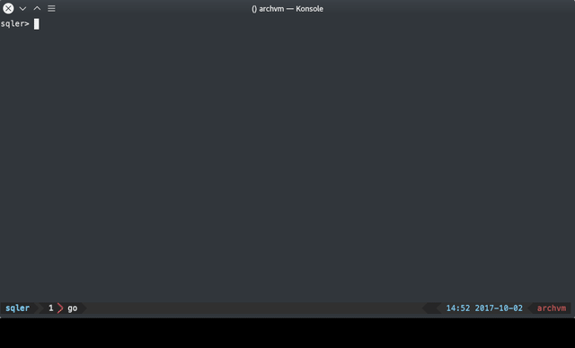

# sqler

Command line interface for multiple sql cli froncli sql

## Supported databases

sqler uses native go sql package other drivers can be added easily, although
some features as database table completion will be limited to the dialect of
sql

| db                | driver                                                               |
| ----------------- | -------------------------------------------------------------------- |
| mssql             | [github.com/denisenkom/go-mssqldb](github.com/denisenkom/go-mssqldb) |
| mysql             | [github.com/go-sql-driver/mysql](github.com/go-sql-driver/mysql)     |
| postgre/cockroach | [github.com/lib/pq](github.com/lib/pq)                               |
| sqlite3           | [github.com/mattn/go-sqlite3](github.com/mattn/go-sqlite3)           |

## TODO

Features are being added as required so the overall project is incomplete

* [ ] Complete parser for better contextualized auto completion
